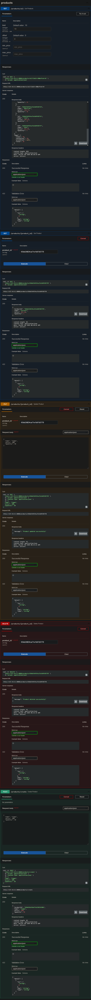
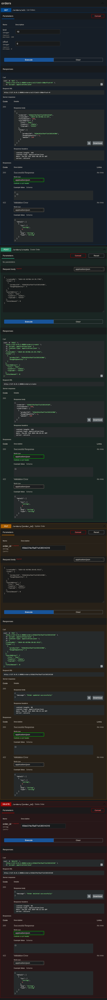
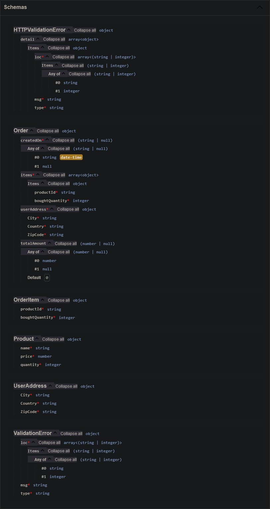

## Fastapi ecommerce Server

### 1. Problem Statement
You need to create a sample backend application in FastAPI, Python and MongoDB. The challenge assumes you have basic knowledge of Python and some knowledge of Flask / Django / FastAPI as well as MongoDB.

### 2. How to run the application

#### 2.1. Clone the repository
```bash
git clone https://github.com/kaustubha-chaturvedi/fastapi-ecommerce-api.git
```

#### 2.2. Install the dependencies
```bash
pip install -r requirements.txt
```

#### 2.3. Run the application using docker-compose
```bash
docker-compose up
```

#### 2.4. Populate DB with fake data
```bash
python fake.py
```

#### 2.5. Without using docker

##### 2.5.1. Create a `.env` file in the root directory and add the following environment variables
```bash
MONGO_URI=<your_mongodb_uri>
```

##### 2.5.2. Run the application
```bash
uvicorn main:app --host 0.0.0.0 --port 8888
```

##### 2.5.3. Open the application in browser
```bash
http://127.0.0.1:8888/docs
```

### 3. API Documentation

#### 3.1. `/products`
- GET
    - `/all/`
    Get list of all products
    - `/all?limit=10`
    Get list of all products with limit of 10
    - `/all?limit=10&offset=5`
    Get list of all products with limit of 10 and offset of 5
    - `/all?min_price=100&max_price=1000`
    Get list of all products filetered by price between 100 and 1000
    - `/all?min_price=100&max_price=1000&limit=10&offset=5`
    Get list of all products filetered by price between 100 and 1000 with limit of 10 and offset of 5
    - `/{product_id}/`
    Get a product
- POST
    - `/create/`
    Create a new product
- PUT
    - `/{product_id}/`
    Update a product
- DELETE
    - `/{product_id}/`
    Delete a product

#### 3.2. `/orders` 
- GET
    - `/all/`
    Get list of all orders
    - `/all?limit=10`
    Get list of all orders with limit of 10
    - `/all?limit=10&offset=5`
    Get list of all orders with limit of 10 and offset of 5
- POST
    - `/create/`
    Create a new order
- PUT
    - `/{order_id}/`
    Update an order
- DELETE
    - `/{order_id}/`
    Delete an order

### 4. Database Schema
#### 4.1. Products
```json
{
    "name": "string",
    "price": "float",
    "quantity": "int"
}
```
#### 4.2. OrderItem
```json
{
    "productId": "string",
    "boughtQuantity": "int"
}
```
#### 4.3. UserAddress
```json
{
    "City": "string",
    "Country": "string",
    "ZipCode": "string"
}
```
#### 4.4. Orders
```json
{
    "createdOn": "Optional[datetime]",
    "orderItems": "List[OrderItem]",
    "userAddress": "userAddress",
    "totalPrice": "Optional[float]"
}
```
### 5. Output Screenshots

#### 5.1. Products

#### 5.2. Orders

#### 5.3. Schemas

